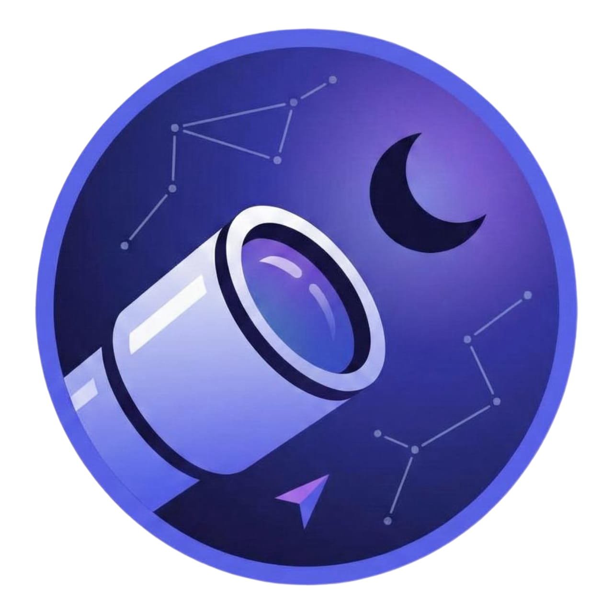

# 🌌 SpaceScope

**Your Personal Window to the Cosmos** - Track satellites, predict cosmic events, and explore space in real-time with stunning AR visualizations.



## ✨ Features

### 🚀 Real-Time Space Data
- **ISS Tracker**: Monitor the International Space Station's position in real-time
- **Space Weather**: Track solar activity, geomagnetic storms, and X-ray flux
- **NASA APOD**: Daily astronomy pictures with full-screen viewing
- **Space News**: Latest headlines from across the space industry

### 🌍 Interactive Visualizations
- **3D Earth Globe**: Interactive globe with real-time satellite tracking
- **AR Sky View**: Augmented reality view of the night sky
- **Mission Timeline**: Explore humanity's space exploration history
- **Time Rewind**: Journey through cosmic time periods

### 📊 Mission Control Dashboard
- Comprehensive dashboard with all space data in one place
- Separate dedicated pages for each feature
- Real-time data from NASA, NOAA, and Spaceflight News APIs

## 🚀 Quick Start

### Prerequisites
- Node.js 18+ and npm installed
- [Install with nvm](https://github.com/nvm-sh/nvm#installing-and-updating)

### Installation

```bash
# Clone the repository
git clone <YOUR_GIT_URL>

# Navigate to the project directory
cd cosmic-navigator

# Install dependencies
npm install

# Start the development server
npm run dev
```

Visit `http://localhost:8083` to see SpaceScope in action!

## 🛠️ Tech Stack

- **Frontend**: React 18 + TypeScript + Vite
- **3D Graphics**: Three.js with React Three Fiber
- **UI Components**: Radix UI + Tailwind CSS
- **State Management**: TanStack React Query
- **Routing**: React Router DOM
- **Animations**: Framer Motion

## 📁 Project Structure

```
cosmic-navigator/
├── public/
│   ├── SpaceScope.png          # App logo
│   └── earth.glb              # 3D Earth model
├── src/
│   ├── components/
│   │   ├── Layout/            # Shared layout components
│   │   ├── SpaceScope/        # Landing page components
│   │   └── ui/                # Reusable UI components
│   ├── pages/                 # Page components
│   ├── services/              # API services
│   ├── types/                 # TypeScript definitions
│   └── lib/                   # Utilities and constants
└── package.json
```

## 🌐 APIs Used

- **NASA APOD**: Astronomy Picture of the Day
- **Open Notify ISS**: Real-time ISS position tracking
- **NOAA Space Weather**: Solar and geomagnetic data
- **Spaceflight News API**: Latest space industry news

## 🎨 Design System

SpaceScope uses a custom cosmic theme with:
- **Colors**: Cosmic glow, nebula purple, aurora pink, star white, space navy
- **Typography**: Space Grotesk for headings, Inter for body text
- **Effects**: Glass morphism, particle systems, starfield backgrounds

## 📝 Available Scripts

```bash
npm run dev          # Start development server
npm run build        # Build for production
npm run preview      # Preview production build
npm run lint         # Run ESLint
npm run test         # Run tests
```

## 🤝 Contributing

1. Fork the repository
2. Create your feature branch (`git checkout -b feature/amazing-feature`)
3. Commit your changes (`git commit -m 'Add amazing feature'`)
4. Push to the branch (`git push origin feature/amazing-feature`)
5. Open a Pull Request

## 📄 License

This project is licensed under the MIT License - see the [LICENSE](LICENSE) file for details.

## 🙏 Acknowledgments

- NASA for providing amazing space data and imagery
- NOAA for space weather monitoring
- Spaceflight News for keeping the community informed
- The open-source community for incredible tools and libraries

---

**Made with ❤️ for space enthusiasts everywhere**

🌟 *Explore the cosmos, one pixel at a time* 🌟
- Edit files directly within the Codespace and commit and push your changes once you're done.

## What technologies are used for this project?

This project is built with:

- Vite
- TypeScript
- React
- shadcn-ui
- Tailwind CSS

## How can I deploy this project?

Simply open [Lovable](https://lovable.dev/projects/REPLACE_WITH_PROJECT_ID) and click on Share -> Publish.

## Can I connect a custom domain to my Lovable project?

Yes, you can!

To connect a domain, navigate to Project > Settings > Domains and click Connect Domain.

Read more here: [Setting up a custom domain](https://docs.lovable.dev/features/custom-domain#custom-domain)
